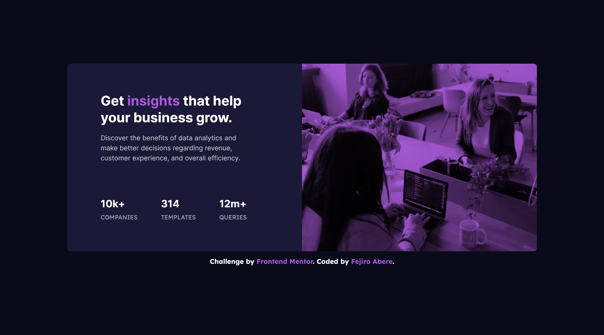

# Frontend Mentor - Stats preview card component solution

This is a solution to the [Stats preview card component challenge on Frontend Mentor](https://www.frontendmentor.io/challenges/stats-preview-card-component-8JqbgoU62). Frontend Mentor challenges help you improve your coding skills by building realistic projects.

## Table of contents

- [Overview](#overview)
  - [The challenge](#the-challenge)
  - [Screenshot](#screenshot)
  - [Links](#links)
- [My process](#my-process)
  - [Built with](#built-with)
  - [What I learned](#what-i-learned)
  - [Continued development](#continued-development)
  - [Useful resources](#useful-resources)
- [Author](#author)
- [Acknowledgments](#acknowledgments)

## Overview

### The challenge

Users should be able to:

- View the optimal layout depending on their device's screen size

### Screenshot



### Links

- Solution URL: [Solution]()
- Live Site URL: [Add live site URL here](https://fejiro001.github.io/stats-preview-card-component-main/)

## My process

### Built with

- Semantic HTML5 markup
- Flexbox
- Mobile-first workflow
- TailwindCSS - For styles

### What I learned

How to blend color with a background image

```html
<div
  class="h-[250px] md:h-[28rem] md:basis-1/2 w-full [background-image:url('../assets/images/image-header-mobile.webp')] min-[768px]:[background-image:url('../assets/images/image-header-desktop.webp')] bg-no-repeat bg-center bg-cover bg-blend-multiply bg-accent"
></div>
```

### Continued development

Expand CSS knowledge

## Author

- Frontend Mentor - [@Fejiro001](https://www.frontendmentor.io/profile/Fejiro001)
- Twitter - [@aberefejiro](https://www.twitter.com/aberefejiro)
